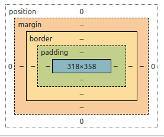

# DayTwo

## Questões

### 1. Explique com suas palavras as diferenças entre uma chamada síncrona e uma chamada em JavaScript. Dê um exemplo de cada uma.

<b>Resp:</b>

#### síncrona
  Uma chamada em síncrona ocorre em sequência e ordenado (seguindo uma fila).

```
  //ex.
  const sum = (a: number, b: number) => a + b
```

#### assíncrona

  Uma função assíncrona ocorre quando lemos um arquivo ou por exemplo realizamos uma chamada para uma API.
  As funções assíncronas no javascript, utilizam Promises para aguardar resultados que não são imediatos.

```
  //ex. 
  interface GetDataOnDatabaseWithAsyncAwaitResponse {
    ...
  }

  const data = getDataOnDatabaseWithAsyncAwait = async (): Promise<GetDataOnDatabaseWithAsyncAwaitResponse> => {
    try{
      const response = await fetch('https://url-da-api.com/')
      const data = await response.json()
      return data
    } catch(error){
      console.log("ERROR: getDataOnDatabaseWithAsyncAwait ~ data ~ error", error)
    }
  }

```

### 2. Qual é a saída do seguinte código escrito em JavaScript?
```
  for (var i = 0; i < 5; i++) {
    setTimeout(function() {
      console.log(i);
    }, 1000)
  }
```

<b>Resp:</b>
a saída do código é:
```
5
5
5
5
5
```
- <b>Motivo:</b>
como a variável `i` dentro do `for` foi instanciada com `var`, que pussui escopo de global, durante o `for` são criadas 5 funções `setTimeOut` que são programadas para ser executadas após 1000ms(1s).
No momento em que a função é executada o valor da variável `i` é `5` e por esse motivo o console.log é executado 5x com o mesmo valor `(5)`.
Esse comportamento seria alterado se a variável fosse instanciada com escopo de bloco utilizando o `let`.

### 3. Defina com suas palavras o que é a internet.

<b>Resp:</b>
A internet é uma rede global de computadores conectados via cabos ou wi-fi(ondas de rádio) que se comunicam através de protocolos TCP/IP (define padrões de como os dados são transmitidos).


### 4. Qual é a diferença entre == e === no JavaScript?

<b>Resp:</b>
Ambos os operadores são utilizados no javascript para realizar comparações.

`==`: É utilizado para comparar os valores não se importando com os tipos. (se os tipos forem diferentes o javascript vai tentar converter para um tipo comum antes de realizar a comparação)
*Exemplo*:
```
  (5 === '5') //true
  (2 === 2)  //true
  (true === 1) //true
```

`===`: É utilizado para comparar tanto os valores quanto os tipos dos valores.
*Exemplo*:
```
  (5 === '5') //false
  (2 === 2)  //true
  (true === 1) // false
```


### 5. Qual é a saída do seguinte código escrito  em JavaScript?

```
  var a = 1;
  function foo() {
    console.log(a);
    var a = 2;
  }
  foo();
```

<b>Resp:</b>
A saída da função foo() é `undefined`
- <b>Motivo:</b>
A primeira declaração `var a = 1` cria uma variável global que pode ser acessada em todo o escopo do código. Portanto, dentro da função `foo()`, o console.log(a) deveria exibir `o valor 1`.
No entanto, devido ao comportamento de `"hoisting"` das declarações `var`, a declaração da variável a dentro da função é movida para o topo do escopo da função. Isso significa que a declaração `var a`; é processada antes da linha do console.log(a), o que resulta em a sendo inicializada com o valor `undefined`.
A atribuição `a = 2 `ocorre posteriormente ao console.log, por este motivo, o valor não é exibido pelo console.log anterior.

### 6. Quais são as diferenças entre os métodos GET e POST em uma requisição HTTP? Por que utilizar cada uma das duas? Cite exemplos.

<b>Resp:</b>
  O protocolo HTTP é um protocolo de comunicação entre cliente e sevidor fundamental para web. 
  O protocolo define alguns métodos como o GET e POST para indicar qual ação vai ser realizada.

<b>O método `GET` é utilizado para solicitar dados para o servidor;</b>

*Exemplo:*
- Enviar uma url para recuperar dados de um determinado usuário.

<b>O método `POST` é utilizado para enviar dados para o servidor;</b>

*Exemplo:*
- Enviar dados de um formulário para criar um usuário dentro do banco de dados.


### 7. Qual a diferença entre magin e padding no CSS?
<b>Resp:</b>
<div>
  
</div>
Como é possível ver na imagem, o padding define o espaçamento entre o elemento e as bordas, enquanto a margin define o espaçamento entre o elemento e os elementos vizinhos, afetando a área ao redor do elemento.

### 8. Escreva uma função em JavaScript que receba uma string como parâmetro e retorne a mesma string sem as vogais.

<b>Resp:</b>
```
  const removeVowels = (word: string): string => {
    const letterList = word.split('').filter(l => !isVowel(l))
    return letterList.join('')
  }

  const isVowel = (letter: string): string => {
    const vowelsList = ['A','À', 'Á', 'Â' ,'E', 'Ê' , 'É', 'I', 'Í', 'O', 'Ô', 'Ó', 'U', 'Ú']
    return vowelsList.includes(letter.toUpperCase())
  }
```

### 9. Cite prós e contras da utilização de SASS, LESS e afins.
<b>Resp:</b>
  - Prós:
    - Criação de classes aninhadas e variáveis;
    - Herança entre estilizações;
    - melhor organização do código;

  - Contras:
    - Necessidade de compilação para CSS antes de ser utilizado em um navegador;

### 10. O que são pseudo-elementos?

<b>Resp:</b>
Um pseudo-element é como adicionar ou direcionar um elemento via `CSS` extra sem ter que adicionar mais HTML.
os mais utilizados são: 
- `::before`:(cria um `pseudo-element` que é inserido antes do conteúdo do elemento selecionado) 
- `::after`: (cria um `pseudo-element` que é inserido depois do conteúdo do elemento selecionado) 

### 11. Conhece alguma metodologia de desenvolvimento front-end e design? Se sim, cite e descreva.

<b>Resp:</b>
  ***atomic desing***:
  baseia-se no principio que os componentes e interfaces podem ser divididos em partes menores e reutilizados
  semelhante a atomos. 
  O atomic desing se divide em 5 níveis (átomos, moléculas, organismos, templates e páginas).

### 12. Como um front-end pode contribuir para melhorar o desempenho de uma aplicação?

<b>Resp:</b>
  Existem várias maneiras de contribuir para a melhora do desempenho de uma aplicação entre elas a
utilização de pré-renderização (SSR), otimização de imagens, utilização de cache, memoização, responsividade, renderização condicional e code splitting(dividir o código em partes menores e carregar apenas os arquivos necessários para página).

### 13. Qual o papel do front-end em acessibilidade?

<b>Resp:</b>
Adaptar a página para que o maior número de pessoas consiga ter acesso ao conteúdo da página por exemplo:

- Utilização de HTML semantico com a utilização de tags corretamente facilida a busca por mecanismos de busca e torna o código mais fácil de ser lido;
- Escolha de uma paleta de cores de fácil visualização e mecanismos de alto contraste ajuda pessoas que possuem médio ou alto déficit de visão;
- Elementos navegaveis do site possam ser acessados via teclado;
- Tamanho adequado de fontes.

### 14. Comente sobre metadados e dados estruturados

<b>Resp:</b>
- Metadados:
Os metadados tentam resumir em poucas palavras o conteúdo de uma página para melhorar a visibilidade dentro dos mecanismos de busca.
Metadados mais frequentes são: ` palavras-chave`, `titulo`, `descrição`, `autor` e `data`.    

- Dados Estruturados:
Os dados podem ser estruturados ou não estruturados.
Dados estruturados são dados em um formato padronizado(rígido) e com uma estrutura bem definida.
Exemplos de dados estruturados: `banco de dados SQL`, `JSON`, `XML`, `CSV`

### 15. O que são, quando e como usar atributos/propriedades "data-*"?

<b>Resp:</b>
As propriedades do tipo data attributes são uteis quando se está trabalhando com javascript vanilla adicionando uma informação diretamente em uma tag html, para seja utilizado via JavaScript ou CSS. exemplo: 

```
  <div id="myElement" data-user-id="123" data-color="red">...</div>
```

dentro do javascript essa informação pode ser capiturada utilizando o código:

```
  const element = document.getElementById('myElement');
  const userId = element.dataset.userId;
```

acesso pelo css 

```
.myElement {
  background-color: attr(data-color);
}
```

